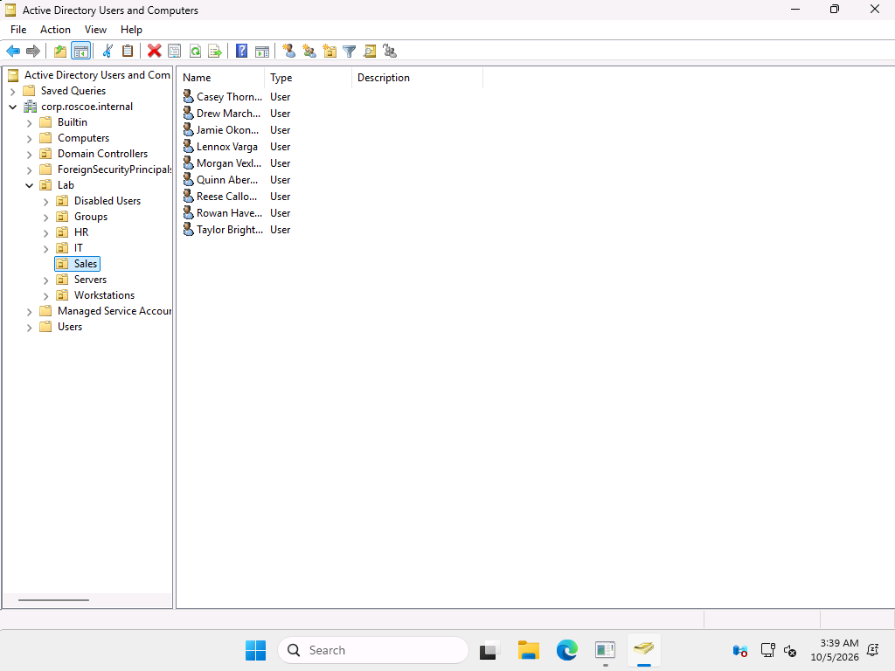
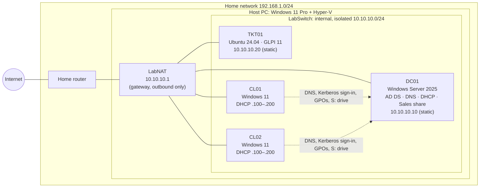
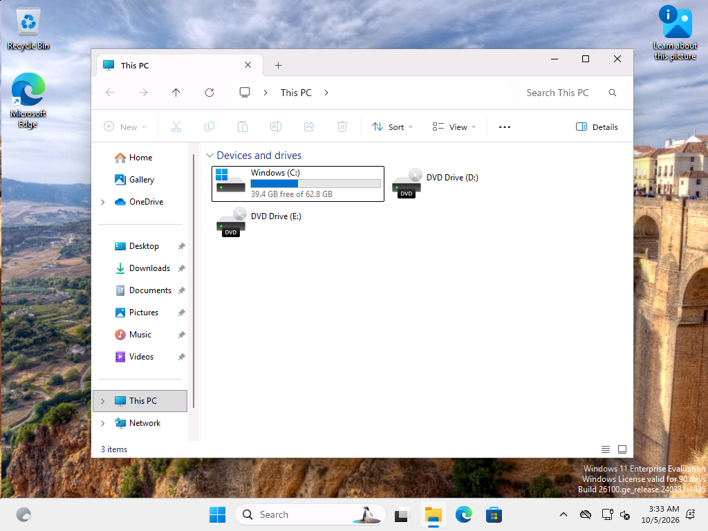
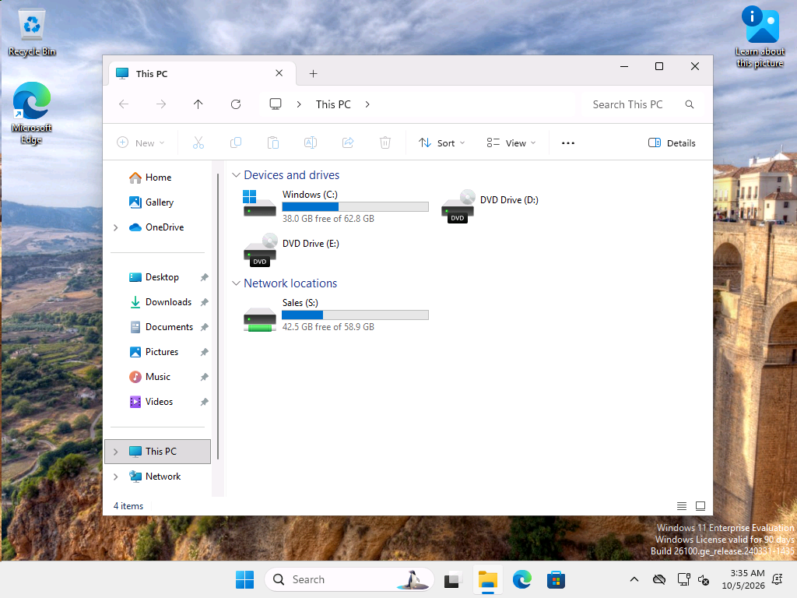

# Active Directory & Help Desk Home Lab

A small, fully scripted company network built on Hyper-V: a Windows Server 2025 domain controller, two domain-joined Windows 11 PCs, and a GLPI ticketing server, used to work five realistic help desk tickets end to end.

Everything is built by PowerShell with unattended installs, so the whole lab can be rebuilt from scratch. All people in it are fictional.

| | |
|---|---|
| **Domain** | `corp.roscoe.internal` (NetBIOS `CORP`) |
| **Network** | Isolated Hyper-V internal switch `10.10.10.0/24` with NAT for internet access |
| **VMs** | DC01 (AD DS, DNS, DHCP, file share) · CL01, CL02 (Windows 11 Enterprise) · TKT01 (Ubuntu 24.04 + GLPI 11) |
| **Resources** | 14 GB RAM max when running, **0 when stopped** · ~111 GB disk |
| **Tickets** | 5 worked in GLPI with the real commands, output and screenshots ([docs/tickets](docs/tickets)) |



---

## Network diagram



**Why an internal switch?** The DC runs a DHCP server. On a bridged (external) switch it would answer DHCP requests from my family's devices, a *rogue DHCP server* that can knock them offline. An internal switch has no connection to the physical network card, so lab traffic physically can't reach the home LAN. Windows NAT gives the lab outbound internet access only.

---

## What each part does and why

| Part | What it does | Why it's built this way |
|---|---|---|
| **DC01** | Domain controller for `corp.roscoe.internal`: Active Directory, DNS (with forwarders and a reverse zone), DHCP (scope `.100–.200`, authorized in AD), the `Sales` file share | Static IP, starts first and stops last, because every other machine depends on its DNS and sign-in. Syncs time from internet NTP, since Kerberos needs clocks within 5 minutes |
| **CL01 / CL02** | Domain-joined Windows 11 Enterprise PCs with virtual TPM | Land in `OU=Workstations` automatically (`redircmp`), so workstation GPOs apply from the first boot |
| **TKT01** | Ubuntu Server with Apache, PHP 8.3, MariaDB and GLPI 11 | Key-only SSH, its own database user, GLPI default accounts disabled, REST API allowed only from the host |
| **OUs** | `Lab\IT`, `Sales`, `HR`, `Disabled Users`, `Groups`, `Workstations`, `Servers` | OUs control *which GPOs apply* and *who can manage what* |
| **Groups** | `SG-IT`, `SG-HelpDesk`, `SG-Sales`, `SG-HR`, `SG-Managers` | Groups control *what people can access*. Access is granted to groups, never to individual users |
| **Delegation** | `SG-HelpDesk` can reset passwords, unlock accounts and set "must change" on users in IT/Sales/HR, and change the members of the department groups | Least privilege: help desk doesn't need Domain Admin. Verified in ticket 01, where the help desk account is **denied** when it tries to edit an admin account |
| **Users** | 15 fake users from CSV, a new hire (ticket 02), and an offboarded former employee (disabled and moved to `Disabled Users`) | Disable, don't delete, so access and history can be restored |

### Group Policy

| GPO | Linked to | Settings | Notes |
|---|---|---|---|
| Default Domain Policy | Domain | 12+ character passwords, complexity, history 24, max age 90 days; **lockout after 5 bad attempts for 15 minutes** | Domain password policy only takes effect at the domain level |
| Map Sales Drive | `OU=Lab` | Maps `S:` → `\\DC01\Sales` (Group Policy Preference) | **Security-filtered** to `SG-Sales`: Authenticated Users can Read, only SG-Sales can Apply |
| User Restrictions - No Control Panel | `OU=Sales`, `OU=HR` | Prohibit access to Control Panel and PC settings | IT is not restricted |
| Workstation Security Baseline | `OU=Workstations` | Interactive logon: don't display last signed-in user | Added after my own sign-in automation typed a username into the previous user's password box. Hiding the last user prevents that and gives an attacker one less piece of the login |

Full settings report exported from Group Policy Management: [docs/gpo-report.html](docs/gpo-report.html).

**Sales share permissions:** share = Authenticated Users *Change*; NTFS = `SG-Sales` *Modify*, admins *Full*, inheritance off, access-based enumeration on. The most restrictive combination wins, so only Sales can get in.

---

## The bulk user script

[`scripts/New-BulkADUsers.ps1`](scripts/New-BulkADUsers.ps1) creates users from a CSV ([`data/users.csv`](data/users.csv)):

```csv
FirstName,LastName,Department,Title,Groups
Avery,Quinlan,IT,Help Desk Technician,SG-IT;SG-HelpDesk
Morgan,Vexley,Sales,Account Executive,SG-Sales
```

For each row it:
1. builds a username from first initial + last name (`aquinlan`), adding 2, 3… if it's taken,
2. creates the user in the OU matching their department (`OU=Sales,OU=Lab,...`),
3. sets a temporary password with **must change at next sign-in**,
4. adds them to every group in the `Groups` column.

It checks that the OUs exist before creating anyone, skips users who already exist (safe to re-run), and supports `-WhatIf` to preview changes:

```powershell
.\New-BulkADUsers.ps1 -CsvPath .\users.csv -WhatIf   # preview, changes nothing
.\New-BulkADUsers.ps1 -CsvPath .\users.csv           # prompts for the temporary password (hidden)
```

The same script was used for the new hire in [ticket 02](docs/tickets/02-new-hire-onboarding.md).

---

## Five help desk tickets

Each ticket was opened in GLPI, worked by the help desk technician *Avery Quinlan* (`CORP\aquinlan`, delegated rights only), and closed with a solution. Every step's command and real output was recorded as a GLPI follow-up and in the walkthroughs below. The "lab setup" sections show how each problem was created, kept separate from the fix.

| # | Ticket | Key steps | Walkthrough |
|---|---|---|---|
| 1 | **Password reset**: Morgan forgot their password | Verify identity → check account → reset with delegated rights + must-change → confirm help desk is denied on an admin account → user signs in, sets new password → verify S: drive and GPOs | [01-password-reset](docs/tickets/01-password-reset.md) |
| 2 | **New-hire onboarding**: Lennox Varga, Sales | `-WhatIf` preview → create with bulk script → verify OU/groups → first sign-in with forced password change → S: drive appears | [02-new-hire-onboarding](docs/tickets/02-new-hire-onboarding.md) |
| 3 | **Locked account**: Taylor | `Search-ADAccount -LockedOut` → **event 4740** on the DC shows source **CL02** → unlock with delegated rights → user signs in | [03-locked-account](docs/tickets/03-locked-account.md) |
| 4 | **Missing mapped drive**: Drew's S: is gone | Group check → `gpresult` shows *Map Sales Drive: Denied (Security)* → replication metadata shows *when* Drew was removed from SG-Sales → re-add → sign out/in (Kerberos ticket) → S: back | [04-missing-mapped-drive](docs/tickets/04-missing-mapped-drive.md) |
| 5 | **Group / permission change**: Reese moves from HR to Sales | Record before-state → swap SG-HR for SG-Sales (help desk) → escalate OU move + title to IT admin → verify access | [05-transfer-group-change](docs/tickets/05-transfer-group-change.md) |

| Before (ticket 04) | After (ticket 04) |
|---|---|
|  |  |

---

## How to run it

**Start / stop** (from `C:\Labs\ad-homelab`, normal PowerShell, no admin needed):

```powershell
.\start-lab.ps1                  # DC01 first (waits for its DNS), then CL01, CL02, TKT01
.\start-lab.ps1 -Only DC01,CL01  # just some VMs
.\stop-lab.ps1                   # clean shutdown, DC01 last; afterwards the lab uses no CPU or RAM
```

No VM starts with Windows (`AutomaticStartAction = Nothing`). Each VM uses dynamic memory with a cap: DC01 4 GB, CL01 4 GB, CL02 4 GB, TKT01 2 GB, 14 GB maximum in total. Connect to a VM with Hyper-V Manager or `vmconnect.exe localhost DC01`. GLPI is at `http://10.10.10.20/` from the host.

**Disk usage:** about 111 GB in `E:\Labs\ad-homelab-vms` (VMs ~91 GB including checkpoints, installer ISOs ~19 GB).

**Rebuild from scratch:** each script is safe to re-run and takes a checkpoint when it finishes.

| Script | What it builds |
|---|---|
| `scripts/setup-host.ps1` (admin, once) | Hyper-V Administrators membership, `LabSwitch`, host IP `10.10.10.1`, `LabNAT` |
| `scripts/01-build-dc.ps1` | DC01 + unattended Windows Server install |
| `scripts/02-configure-dc.ps1` | Static IP, AD DS / DNS / DHCP, new forest, time sync, `labadmin` |
| `scripts/03-ad-structure.ps1` | OUs, groups, delegation, bulk users, offboarded user |
| `scripts/04-build-clients.ps1` | CL01, CL02 + domain join |
| `scripts/05-gpo-fileshare.ps1` | Sales share, password policy, 3 GPOs |
| `scripts/06-build-ticketing.ps1` | TKT01 Ubuntu autoinstall, SSH key, DNS record |
| `scripts/07-install-glpi.ps1` | GLPI 11 (checksum-verified download) |
| `scripts/08-glpi-configure.ps1` | GLPI API (host only), technician and users, categories |
| `scripts/tickets/ticket-0N-*.ps1` | The five ticket walkthroughs |

Checkpoints: `01-OS-installed` → … → `05-tickets-complete` on each VM, for one-click rollback in Hyper-V Manager.

---

## Security notes

- **No passwords in this repo.** All lab passwords were randomly generated into `lab-secrets.txt`, which `.gitignore` excludes, along with the SSH key (`lab-ssh/`) and the filled-in answer files (`unattend/out/`). Scripts read passwords from that file and pass them as SecureStrings or through stdin, so they never appear in command lines, ticket notes or screenshots. Generated answer files are deleted after each install.
- **Nothing is exposed to the internet.** The lab sits behind outbound-only NAT; the GLPI API only accepts the host's lab address.
- **Evaluation licenses:** Windows Server 2025 (180 days) and Windows 11 Enterprise (90 days), activated online. The clients can be rebuilt with the scripts in a few minutes when they expire.
- **Lab shortcuts I'd change in production:** GLPI runs over plain HTTP; `labadmin` on TKT01 has passwordless sudo (only reachable with the SSH key); the DC is the only DC (no redundancy) and also the file server.

## What I'd add next

- **AD Certificate Services**, then HTTPS for GLPI and **LDAPS** so GLPI users can sign in with their AD accounts (Server 2025 DCs reject unencrypted LDAP binds by default, which is why I didn't connect GLPI to AD over plain LDAP).
- A second domain controller to practice replication and FSMO roles.
- Fine-grained password policy for admin accounts, LAPS for local admin passwords, and a basic backup/restore of AD.
