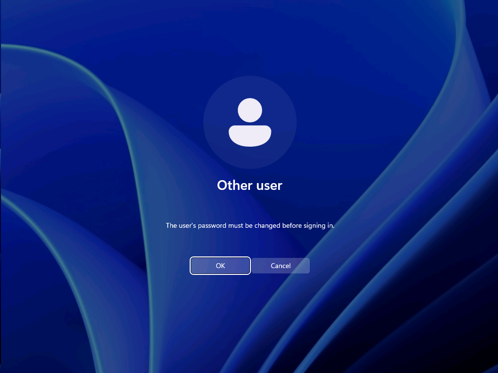
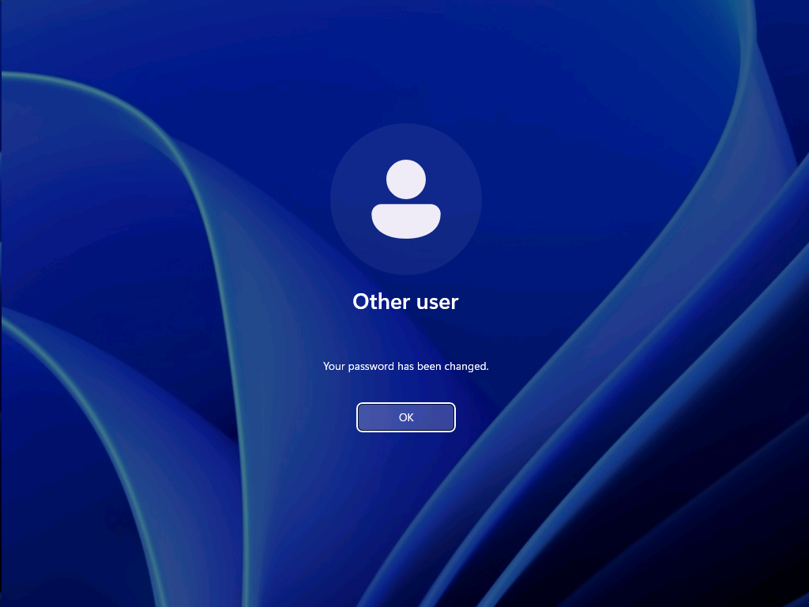
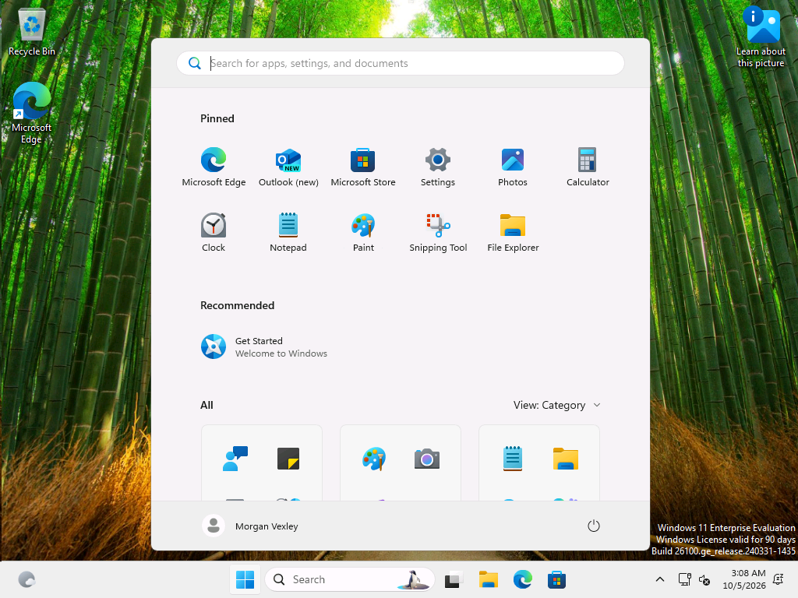

# Ticket 01: Forgot password - cannot sign in

| | |
|---|---|
| GLPI ticket | #1 (Incident, category: Account Access) |
| Requester | mvexley (fake user) |
| Assigned to | aquinlan, Avery Quinlan (help desk, SG-HelpDesk) |
| Status | Solved |

**User's report:** Morgan Vexley (Sales) called: came back from a week off, forgot their password and cannot sign in to their PC. Needs to work on a customer quote this morning.

## Troubleshooting and fix

### 1. Note

Verified the caller before making any change: called Morgan back on the desk number listed in the company directory and confirmed their manager (Casey Thornbury). Never reset a password based only on an inbound call. (Simulated in the lab.)

### 2. Check the account before changing anything

*Ran on DC01 as CORP\aquinlan (help desk)*

Account is enabled and not locked, so this is a forgotten password, not a lockout or a disabled account.

```powershell
Get-ADUser mvexley -Credential $cred -Properties Enabled, LockedOut, PasswordExpired, PasswordLastSet, LastLogonDate, badPwdCount, DistinguishedName |
    Format-List SamAccountName, DistinguishedName, Enabled, LockedOut, PasswordExpired, PasswordLastSet, LastLogonDate, badPwdCount
```
```text
SamAccountName    : mvexley
DistinguishedName : CN=Morgan Vexley,OU=Sales,OU=Lab,DC=corp,DC=roscoe,DC=internal
Enabled           : True
LockedOut         : False
PasswordExpired   : True
PasswordLastSet   : 
LastLogonDate     : 
badPwdCount       : 0
```

### 3. Reset the password and require a change at next sign-in

*Ran on DC01 as CORP\aquinlan (help desk)*

Temporary password given to Morgan over the phone (never by email or chat). It only works until Morgan picks a new one.

```powershell
# Runs as CORP\aquinlan, who has only the delegated "Reset Password" and pwdLastSet rights on the Sales OU.
Set-ADAccountPassword mvexley -Reset -NewPassword $tempPassword -Credential $cred
Set-ADUser mvexley -ChangePasswordAtLogon $true -Credential $cred
Get-ADUser mvexley -Properties pwdLastSet -Credential $cred | Select-Object SamAccountName, @{ n = 'MustChangeAtNextLogon'; e = { $_.pwdLastSet -eq 0 } }
```
```text
SamAccountName        : mvexley
MustChangeAtNextLogon : True
```

### 4. Confirm the help desk account cannot change accounts outside its delegation

*Ran on DC01 as CORP\aquinlan (help desk)*

```powershell
# Least-privilege check: Avery can reset Sales users, but must NOT be able to modify an admin account.
try {
    Set-ADUser labadmin -Description 'help desk write test' -Credential $cred -ErrorAction Stop
    'UNEXPECTED: write to labadmin succeeded'
} catch { "Expected result - access denied: $($_.Exception.Message)" }
```
```text
Expected result - access denied: Insufficient access rights to perform the operation
```

### 5. Note

Morgan signed in on CL01 with the temporary password, was required to choose a new one, and reached the desktop.

### 6. Verify the account after Morgan signed in

*Ran on DC01 as CORP\aquinlan (help desk)*

PasswordLastSet is now the time Morgan chose a new password, and the must-change flag is cleared.

```powershell
Get-ADUser mvexley -Credential $cred -Properties PasswordLastSet, pwdLastSet, LastLogonDate, badPwdCount, LockedOut |
    Format-List SamAccountName, PasswordLastSet, @{ n = 'MustChangeAtNextLogon'; e = { $_.pwdLastSet -eq 0 } }, LockedOut, badPwdCount
```
```text
SamAccountName        : mvexley
PasswordLastSet       : 10/5/2026 3:07:50 AM
MustChangeAtNextLogon : False
LockedOut             : False
badPwdCount           : 0
```

### 7. Check Morgan's session, S: drive and policies on CL01

*Ran on CL01 as CORP\labadmin*

Morgan is a Sales user, so the S: drive and the Control Panel restriction should both apply.

```powershell
quser
$sid = (New-Object Security.Principal.NTAccount('CORP\mvexley')).Translate([Security.Principal.SecurityIdentifier]).Value
"S: drive -> " + (Get-ItemProperty "Registry::HKEY_USERS\$sid\Network\S" -ErrorAction SilentlyContinue).RemotePath
"Control Panel blocked (NoControlPanel) = " + (Get-ItemProperty "Registry::HKEY_USERS\$sid\Software\Microsoft\Windows\CurrentVersion\Policies\Explorer" -ErrorAction SilentlyContinue).NoControlPanel
gpresult /user CORP\mvexley /scope user /r | Select-String -Pattern 'Applied Group Policy Objects' -Context 0, 4 | ForEach-Object { $_.ToString().Trim() }
```
```text
USERNAME              SESSIONNAME        ID  STATE   IDLE TIME  LOGON TIME
 mvexley               console             2  Active      none   10/5/2026 3:07 AM
S: drive -> \\DC01.corp.roscoe.internal\Sales
Control Panel blocked (NoControlPanel) = 1
>     Applied Group Policy Objects
      -----------------------------
          User Restrictions - No Control Panel
          Map Sales Drive
```







## Root cause

User forgot their password after time off. The account itself was healthy (enabled, not locked out).

## Resolution

Verified the caller by calling back the directory number. Reset the password with delegated help desk rights, required a change at next sign-in, and confirmed Morgan signed in on CL01 and set a new password. S: drive and policies loaded normally.
