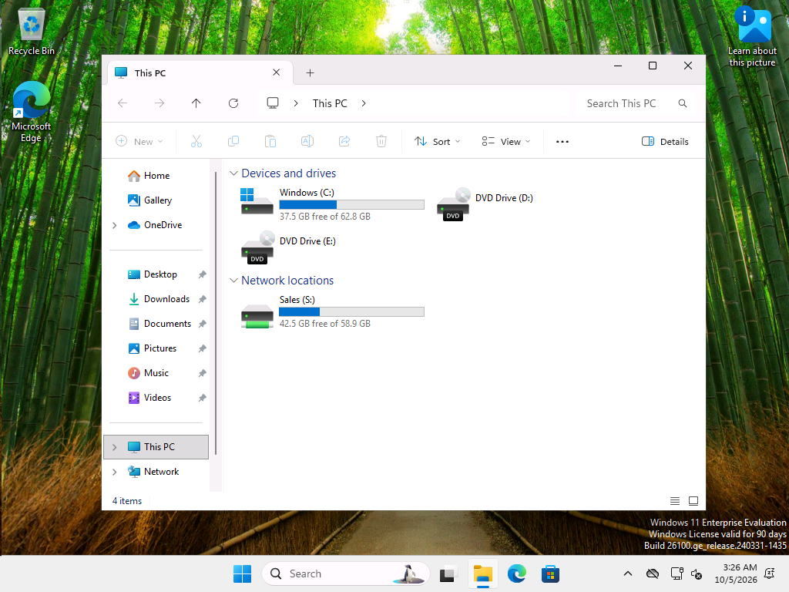

# Ticket 02: New hire: Lennox Varga, Sales Representative, starts today

| | |
|---|---|
| GLPI ticket | #2 (Request, category: Onboarding) |
| Requester | cthornbury (fake user) |
| Assigned to | aquinlan, Avery Quinlan (help desk, SG-HelpDesk) |
| Status | Solved |

**User's report:** Casey Thornbury (Sales Manager): Lennox Varga joins Sales as a Sales Representative today. Needs a computer login, the Sales shared drive, and the standard Sales setup.

## Troubleshooting and fix

### 1. Note

Request came from the hiring manager (Casey Thornbury). Matched it to the HR new-hire notice for Lennox Varga before creating anything. (Simulated in the lab.)

### 2. Preview the account with the bulk-user script (-WhatIf)

*Ran on DC01 as CORP\labadmin*

Same script and CSV format used to create the original 15 users. -WhatIf shows what would happen without changing anything.

```powershell
Set-Content -Path C:\LabScripts\new-hire-lvarga.csv -Value $csv -Encoding UTF8
& C:\LabScripts\New-BulkADUsers.ps1 -CsvPath C:\LabScripts\new-hire-lvarga.csv -InitialPassword $initialPassword -WhatIf 6>&1
```
```text
[preview] Would create Lennox Varga -> lvarga in OU=Sales,OU=Lab,DC=corp,DC=roscoe,DC=internal (groups: SG-Sales)

Preview only, nothing changed. Would skip: 0
```

### 3. Create the account

*Ran on DC01 as CORP\labadmin*

Run with an IT admin account (CORP\labadmin): creating accounts is outside the help desk delegation.

```powershell
& C:\LabScripts\New-BulkADUsers.ps1 -CsvPath C:\LabScripts\new-hire-lvarga.csv -InitialPassword $initialPassword 6>&1
```
```text
[create] Lennox Varga -> lvarga (Sales; groups: SG-Sales)

Done. Created: 1  Skipped: 0
```

### 4. Verify OU, title, groups and first-login settings

*Ran on DC01 as CORP\aquinlan (help desk)*

```powershell
Get-ADUser lvarga -Credential $cred -Properties Department, Title, pwdLastSet, Enabled |
    Format-List SamAccountName, UserPrincipalName, DistinguishedName, Department, Title, Enabled, @{ n = 'MustChangeAtNextLogon'; e = { $_.pwdLastSet -eq 0 } }
'Groups: ' + ((Get-ADPrincipalGroupMembership lvarga -Credential $cred).Name -join ', ')
```
```text
SamAccountName        : lvarga
UserPrincipalName     : lvarga@corp.roscoe.internal
DistinguishedName     : CN=Lennox Varga,OU=Sales,OU=Lab,DC=corp,DC=roscoe,DC=internal
Department            : Sales
Title                 : Sales Representative
Enabled               : True
MustChangeAtNextLogon : True


Groups: Domain Users, SG-Sales
```

### 5. Note

Gave Lennox the username (lvarga) and the temporary first-login password in person on their first morning. (Simulated in the lab.)

### 6. Note

Lennox signed in on CL02, chose their own password, and File Explorer shows the Sales (S:) drive.

### 7. Confirm Lennox's drive and policies on CL02

*Ran on CL02 as CORP\labadmin*

```powershell
$sid = (New-Object Security.Principal.NTAccount('CORP\lvarga')).Translate([Security.Principal.SecurityIdentifier]).Value
"S: drive -> " + (Get-ItemProperty "Registry::HKEY_USERS\$sid\Network\S" -ErrorAction SilentlyContinue).RemotePath
"Control Panel blocked (NoControlPanel) = " + (Get-ItemProperty "Registry::HKEY_USERS\$sid\Software\Microsoft\Windows\CurrentVersion\Policies\Explorer" -ErrorAction SilentlyContinue).NoControlPanel
gpresult /user CORP\lvarga /scope user /r | Select-String -Pattern 'Applied Group Policy Objects' -Context 0, 4 | ForEach-Object { $_.ToString().Trim() }
```
```text
S: drive -> \\DC01.corp.roscoe.internal\Sales
Control Panel blocked (NoControlPanel) = 1
>     Applied Group Policy Objects
      -----------------------------
          User Restrictions - No Control Panel
          Map Sales Drive
```




## Root cause

Not a fault: standard new-hire request.

## Resolution

Created lvarga in OU=Sales with the bulk-user script (one CSV row), in SG-Sales, with a temporary password that must be changed at first sign-in. Lennox signed in on CL02, set a new password, and received the S: drive and Sales policies automatically through group membership and Group Policy.
