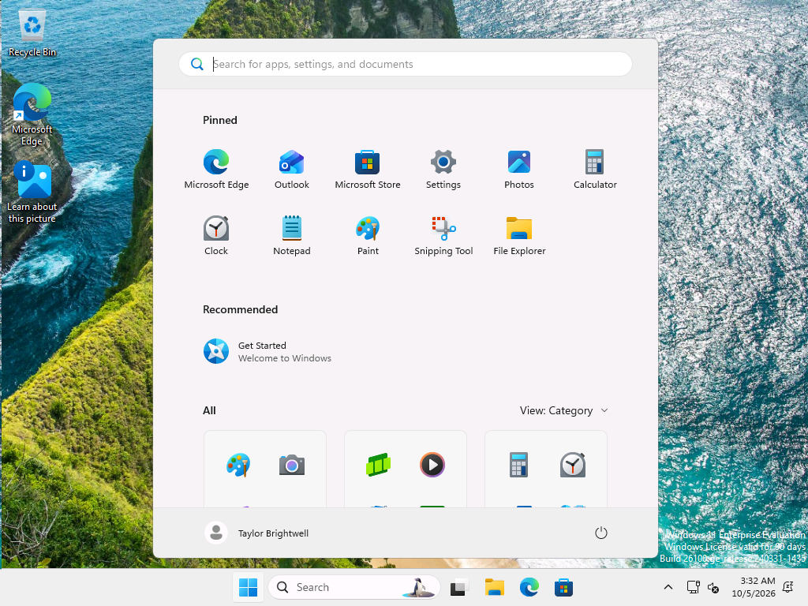

# Ticket 03: Account locked out - cannot sign in

| | |
|---|---|
| GLPI ticket | #3 (Incident, category: Account Access) |
| Requester | tbrightwell (fake user) |
| Assigned to | aquinlan, Avery Quinlan (help desk, SG-HelpDesk) |
| Status | Solved |

**User's report:** Taylor Brightwell (Sales) called: Windows says "The referenced account is currently locked out and may not be logged on to." Taylor is sure they are typing the right password now.

## Lab setup (simulating the problem)

**Setup: give Taylor a normal, working password** (on DC01 as CORP\labadmin)

```powershell
Set-ADAccountPassword tbrightwell -Reset -NewPassword $pw
Set-ADUser tbrightwell -ChangePasswordAtLogon $false
'Taylor has a working password (simulates an existing user).'
```
```text
Taylor has a working password (simulates an existing user).
```

**Setup: six sign-in attempts with wrong (old) passwords from CL02** (on CL02 as CORP\labadmin)

```powershell
foreach ($i in 1..6) {
    # A different wrong password each time (in testing, repeating one identical bad password did not raise the counter every time).
    $r = cmd /c "net use \\DC01\IPC$ /user:CORP\tbrightwell OldPassword$i! 2>&1"
    "Attempt ${i}: " + (($r | Where-Object { $_ -match 'error|locked|password' }) -join ' ').Trim()
}
```
```text
Attempt 1: System error 1326 has occurred. The user name or password is incorrect.
Attempt 2: System error 1326 has occurred. The user name or password is incorrect.
Attempt 3: System error 1909 has occurred. The referenced account is currently locked out and may not be logged on to.
Attempt 4: System error 1909 has occurred. The referenced account is currently locked out and may not be logged on to.
Attempt 5: System error 1909 has occurred. The referenced account is currently locked out and may not be logged on to.
Attempt 6: System error 1909 has occurred. The referenced account is currently locked out and may not be logged on to.
```

## Troubleshooting and fix

### 1. Confirm the account is locked out

*Ran on DC01 as CORP\aquinlan (help desk)*

Locked out, not disabled and not expired. The lockout policy is 5 bad attempts within 15 minutes.

```powershell
Search-ADAccount -LockedOut -UsersOnly -Credential $cred | Select-Object SamAccountName, LockedOut | Format-Table -AutoSize
Get-ADUser tbrightwell -Credential $cred -Properties LockedOut, AccountLockoutTime, badPwdCount, LastBadPasswordAttempt, Enabled |
    Format-List SamAccountName, Enabled, LockedOut, AccountLockoutTime, badPwdCount, LastBadPasswordAttempt
```
```text
SamAccountName LockedOut
-------------- ---------
tbrightwell         True


SamAccountName         : tbrightwell
Enabled                : True
LockedOut              : True
AccountLockoutTime     : 10/5/2026 3:30:20 AM
badPwdCount            : 5
LastBadPasswordAttempt : 10/5/2026 3:30:20 AM
```

### 2. Find where the bad passwords came from (event 4740 on the DC)

*Ran on DC01 as CORP\labadmin*

Reading the DC Security log needs admin (or Event Log Readers) rights, so this step used the IT admin account.

```powershell
# Event 4740 = "A user account was locked out". Its "Caller Computer Name" says which machine sent the bad passwords.
Get-WinEvent -FilterHashtable @{ LogName = 'Security'; Id = 4740 } -MaxEvents 10 -ErrorAction SilentlyContinue |
    Where-Object { $_.Properties[0].Value -eq 'tbrightwell' } | Select-Object -First 1 |
    ForEach-Object { [pscustomobject]@{ Time = $_.TimeCreated; LockedAccount = $_.Properties[0].Value; CallerComputer = $_.Properties[1].Value } } |
    Format-List
```
```text
Time           : 10/5/2026 3:30:20 AM
LockedAccount  : tbrightwell
CallerComputer : CL02
```

### 3. Note

Asked Taylor about CL02: Taylor used the shared PC at the front desk earlier and tried an old password several times there. (Simulated in the lab: six wrong-password attempts from CL02.) Nothing suspicious; the attempts came from inside the office.

### 4. Unlock the account

*Ran on DC01 as CORP\aquinlan (help desk)*

No password reset needed: Taylor knows the current password, the lockout came from an old one.

```powershell
# Runs as CORP\aquinlan using the delegated write access to lockoutTime on the Sales OU.
Unlock-ADAccount tbrightwell -Credential $cred
Get-ADUser tbrightwell -Credential $cred -Properties LockedOut | Select-Object SamAccountName, LockedOut | Format-Table -AutoSize
```
```text
SamAccountName LockedOut
-------------- ---------
tbrightwell        False
```

### 5. Note

Taylor signed in on CL02 successfully with their current password.

### 6. Verify the account is healthy after sign-in

*Ran on DC01 as CORP\aquinlan (help desk)*

```powershell
Get-ADUser tbrightwell -Credential $cred -Properties LockedOut, badPwdCount, LastLogonDate |
    Format-List SamAccountName, LockedOut, badPwdCount, LastLogonDate
```
```text
SamAccountName : tbrightwell
LockedOut      : False
badPwdCount    : 0
LastLogonDate  : 10/5/2026 3:31:52 AM
```



## Root cause

Repeated sign-in attempts with old passwords from the shared PC CL02 reached the domain lockout threshold (5 bad attempts within 15 minutes), and the account locked partway through the attempts (see the setup output). In the lab these attempts were simulated with net use; earlier failed attempts from a first test run were still inside the 15-minute window and counted too.

## Resolution

Confirmed the lockout, traced it to CL02 with event 4740 on the domain controller, confirmed with Taylor that the attempts were theirs, and unlocked the account with delegated help desk rights. Taylor signed in normally. Advised Taylor to sign out of shared PCs and not to retry an old password. If lockouts come back, check CL02 for saved credentials (Credential Manager, mapped drives, scheduled tasks).
