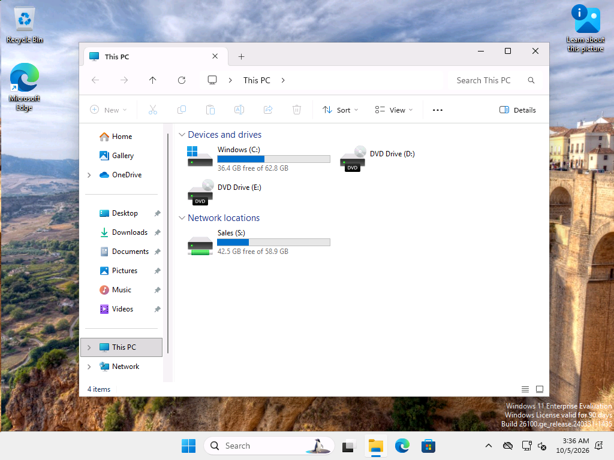

# Ticket 05: Transfer: Reese Calloway from HR to Sales (access change)

| | |
|---|---|
| GLPI ticket | #5 (Request, category: Permissions) |
| Requester | plindqvist (fake user) |
| Assigned to | aquinlan, Avery Quinlan (help desk, SG-HelpDesk) |
| Status | Solved |

**User's report:** Parker Lindqvist (HR Manager): Reese Calloway moves from HR (Recruiter) to Sales as a Sales Coordinator starting today. Please give Reese the Sales access and remove HR access.

## Lab setup (simulating the problem)

**Setup: give Reese a normal, working password** (on DC01 as CORP\labadmin)

```powershell
Set-ADAccountPassword rcalloway -Reset -NewPassword $pw
Set-ADUser rcalloway -ChangePasswordAtLogon $false
'Reese has a working password (simulates an existing user).'
```
```text
Reese has a working password (simulates an existing user).
```

## Troubleshooting and fix

### 1. Note

Approvals: requested by Reese's current manager (Parker Lindqvist, HR) and approved by the new manager (Casey Thornbury, Sales). (Simulated in the lab.)

### 2. Record the current state before changing anything

*Ran on DC01 as CORP\aquinlan (help desk)*

Writing down the "before" state makes the change easy to reverse if needed.

```powershell
Get-ADUser rcalloway -Credential $cred -Properties Department, Title | Format-List SamAccountName, DistinguishedName, Department, Title
'Groups: ' + ((Get-ADPrincipalGroupMembership rcalloway -Credential $cred).Name -join ', ')
```
```text
SamAccountName    : rcalloway
DistinguishedName : CN=Reese Calloway,OU=HR,OU=Lab,DC=corp,DC=roscoe,DC=internal
Department        : HR
Title             : Recruiter


Groups: Domain Users, SG-HR
```

### 3. Swap the department group: remove SG-HR, add SG-Sales

*Ran on DC01 as CORP\aquinlan (help desk)*

Removing the old group matters as much as adding the new one, to avoid privilege creep.

```powershell
# Runs as CORP\aquinlan using the delegated "write members" right on OU=Groups.
Remove-ADGroupMember SG-HR -Members rcalloway -Credential $cred -Confirm:$false
Add-ADGroupMember SG-Sales -Members rcalloway -Credential $cred
'Groups now: ' + ((Get-ADPrincipalGroupMembership rcalloway -Credential $cred).Name -join ', ')
```
```text
Groups now: Domain Users, SG-Sales
```

### 4. Move the account to OU=Sales and update the job details

*Ran on DC01 as CORP\labadmin*

Escalated to an IT admin (CORP\labadmin): moving accounts between OUs is outside the help desk delegation. The OU decides which GPOs apply and who can manage the account.

```powershell
$d = (Get-ADDomain).DistinguishedName
Get-ADUser rcalloway | Move-ADObject -TargetPath "OU=Sales,OU=Lab,$d"
Set-ADUser rcalloway -Department 'Sales' -Title 'Sales Coordinator'
Get-ADUser rcalloway -Properties Department, Title | Format-List SamAccountName, DistinguishedName, Department, Title
```
```text
SamAccountName    : rcalloway
DistinguishedName : CN=Reese Calloway,OU=Sales,OU=Lab,DC=corp,DC=roscoe,DC=internal
Department        : Sales
Title             : Sales Coordinator
```

### 5. Note

Reese signed in on CL02 after the change.

### 6. Verify Reese's new access on CL02

*Ran on CL02 as CORP\labadmin*

```powershell
$sid = (New-Object Security.Principal.NTAccount('CORP\rcalloway')).Translate([Security.Principal.SecurityIdentifier]).Value
"S: drive -> " + (Get-ItemProperty "Registry::HKEY_USERS\$sid\Network\S" -ErrorAction SilentlyContinue).RemotePath
gpresult /user CORP\rcalloway /scope user /r | Select-String -Pattern 'Applied Group Policy Objects' -Context 0, 4 | ForEach-Object { $_.ToString().Trim() }
```
```text
S: drive -> \\DC01.corp.roscoe.internal\Sales
>     Applied Group Policy Objects
      -----------------------------
          User Restrictions - No Control Panel
          Map Sales Drive
```



## Root cause

Not a fault: approved department transfer.

## Resolution

With both managers' approval, removed Reese from SG-HR and added them to SG-Sales (help desk, delegated rights), then an IT admin moved the account to OU=Sales and set Department = Sales, Title = Sales Coordinator. Reese signed in on CL02 and received the S: drive through the SG-Sales group. HR access was removed at the same time to prevent privilege creep.
